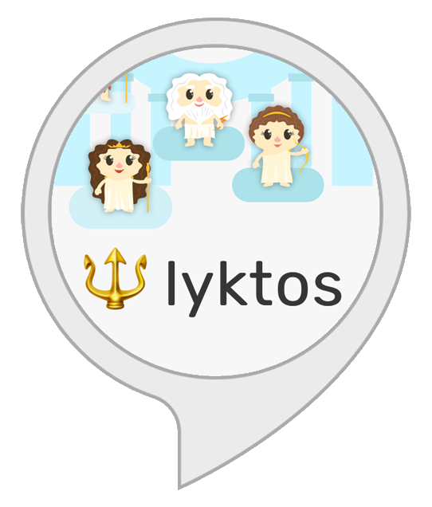

# :trident: mythology land alexa skill

*mythology land* is an educational [alexa](https://en.wikipedia.org/wiki/Amazon_Echo) skill about [greek](https://en.wikipedia.org/wiki/Greek_mythology) and [roman](https://en.wikipedia.org/wiki/Roman_mythology) mythology and their gods and goddesses.

### Example Conversation
1. *Alexa, open mythology land*
2. *List greek gods*
3. *Tell me more about Hermes*
4. *Who are the parents of Mercury?*
5. *Compare mercury and its counterpart*
6. *What are typical symbols of Minerva?*
7. *Who is the counterpart of Neptune?*
8. *Tell me about this project.*

## Interaction Model

### Intents
|Name|Sample Utterance|
|---|---|
|`ListGodsIntent`|*List greek gods.*|
|`GodDetailIntent`|*Tell me more about Zeus.*|
|`CompareGodsIntent`|*Compare zeus with its counterpart.*|
|`SymbolsIntent`|*What are typical symbols of Hera?*|
|`ParentsIntent`|*Who are the parents of Minerva?*|
|`CounterpartIntent`|*Who is the counterpart of Neptune?*|
|`AboutIntent`|*Tell me about this project.*|

### Slot types
|Name|Values|
|---|---|
|`GodType`|`greek`, `roman`|
|`God`|`zeus`, `hera`, `poseidon`, ...|

## Endpoint
The endpoint is a [Node.js](https://nodejs.org) [AWS Lambda](https://aws.amazon.com/lambda/) function using the Alexa Skills Kit SDK for Node.js [`ask-sdk`](https://github.com/alexa/alexa-skills-kit-sdk-for-nodejs).

Check out the lambda function in [`/lambda/custom`](./lambda/custom).

## Thank you!
- All information is taken from [Wikipedia](https://www.wikipedia.org)
- Gods [Vector Illustration by www.Vecteezy.com](https://www.vecteezy.com/)
- Heaven background [Designed by macrovector / Freepik](http://www.freepik.com)

## :trident: lyktos webapp
Also check out the corresponding webapp **:trident: lyktos**, which is also [open source](https://github.com/FranzDiebold/lyktos)!
